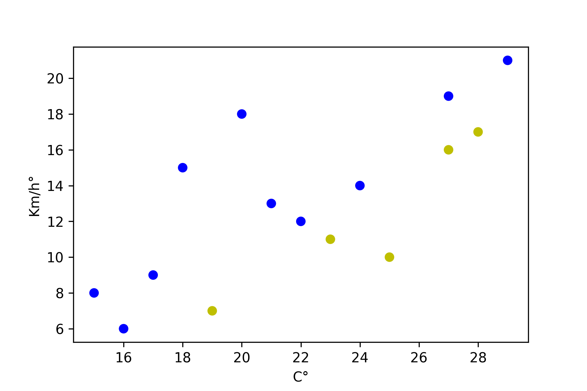
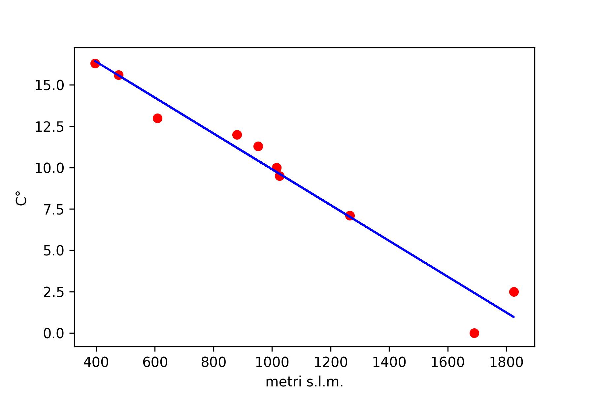
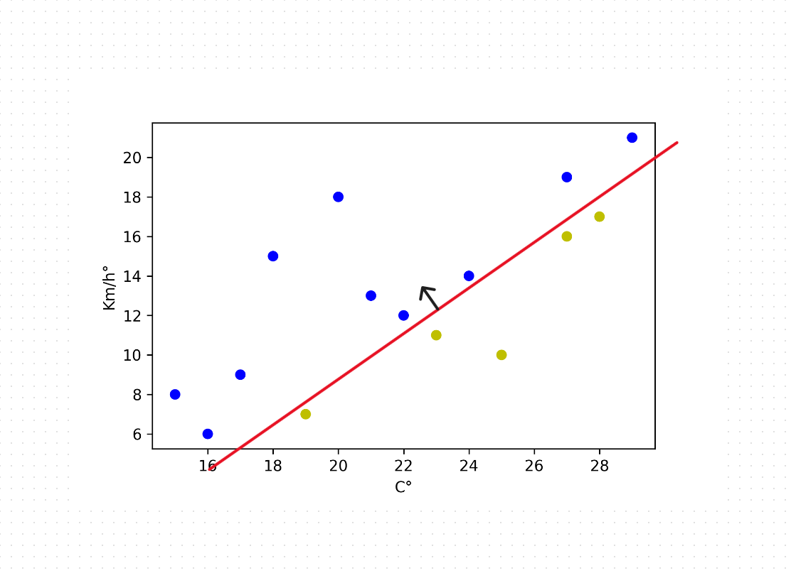
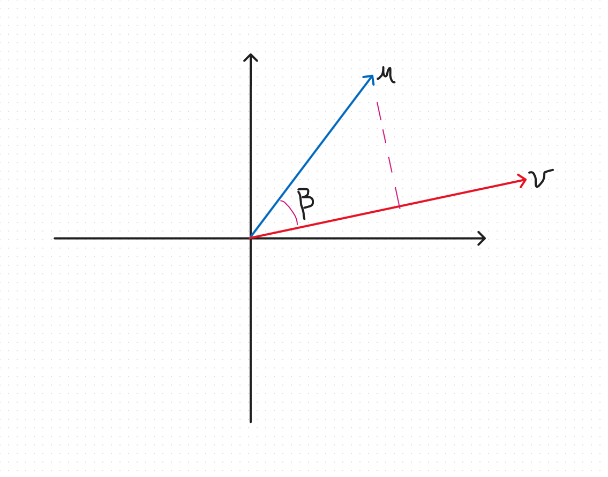

# Machine Learning

> "Campo di studio che dà ai computer la capacità di apprendere senza essere esplicitamente programmati" (Arthur Samuel)

Programmi che sono in grado di riconoscere schemi dai dati forniti e, in base a questi, prendeno decisioni o compiono previsioni. I punti sul grafico in basso sono colorati in giallo se il tempo è soleggiato e in blu se è piovoso, la posizione del punto dipende dalla temperatura e la velocià del vento. 

- Acquisizione ed osservazione dei *dati di addestramento* 
- Creazione del modello che potrebbe aver generato quei dati
- Utilizzo del modello per formulare previsioni su altri esempi

Il **modello** è una generalizzazione degli esempi forniti. Gli approcci al problema comprendono

- La rappresentazione del modello
- Una funzione obiettivo che valuta la bontà del modello
- Un metodo che apprenda un modello massimizzando/minimizzando la funzione obiettivo

Nell'esempio il modello è un iperpiano che separa i dati positivi da quelli negativi. La funzione obiettivo potrebbe essere la percentuale di dati classificati correttamente. L'algoritmo trova l'iperpiano che massimizza la funzione obiettivo.

## Classi di problemi

### Classificazione

I dati di addestramento sono coppie $(x_1, y_0), \ldots, (x_n, y_n)$ dove $x_i$ rappresentano delle caratteristiche degli elementi classificati e $y_i$ la classe (un intero) a cui appartengono. Gli $x_i$ sono vettori in uno spazio $d$-dimensionale (spazio delle *features*). L'esempio precedente mostra un problema di classificazione: lo spazio delle features ha dimensione $2$ (temperatura e vento) e $y_i \in \{0, 1\}$. 

### Regressione

Un esempio di problema di regressione: partendo da un insieme di misurazioni della temperatura a quote diverse, è possibile inferire una regola che data una qualsiasi quota fornisca la temperatura a quella quota?

Dall'esempio si capisce che la retta rossa è una buona scelta.

Possiamo definire i problemi di classificazione come problemi di regressione in cui $y_i \in R$. 

### Clusterizzazione

Dato un insieme di esempio $x_1, x_2\ldots, x_n$ nello spazio $R^d$, trovare un partizionamento (o claster) in insiemi di esempi 'simili'. Il modo in cui valutare la qualità della partizione dipende dall'applicazione. Ad esempio si può minimizzare la distanza media tra gli elementi in un cluster.

## Criteri di valutazione e *loss function*

$L(g, c)$ indica quanto si è  penalizzati se l'ipotesi ritornata è $g$ ma la risposta corretta è $c$. Tipiche loss-function

- Binaria

    $$
    L(g,c) = \left\{
    \begin{array}{lll}
    0& &\mbox{if}\ c \equiv g\\
    1& &\mbox{otherwise}
    \end{array}
    \right.
    $$
  
- Lineare
    $$L(g,c) = |g-c|$$
- Quadratica
    $$L(g,c) = (g-c)^2$$
    
La valutazione di un algoritmo richiederà la sintesi delle loss di un insieme di previoni che può essere ottenuta

- calcolando la media delle loss su un insieme di esperimenti
- calcolando il caso peggiore
- ...

l'algoritmo dovrà ritornare un modello che minimizzi una delle precedenti valutazioni.

## La scelta del modello e suo adattamento (*fitting*)

Sia $(x^{(1)}, y^{(1)}),\ldots,(x^{(n)}, y^{(n)})$ una sequenza di dati osservati dove ogni $x^{(i)}$ è un array a $d$ dimensioni, una per ciascuna caratteristica osservata e $y^{(i)}$ è il risultato corrispondente.

Si vuole definire un modello che possa prevedere il risultato per un dato non osservato $x^{(n+1)}$.

Si parte da ipotizzare un modello $h(x; a)$, ovvero una funzione delle osservazioni $x$ che dipende dai parametri $a$, usando $x^{(1)},\ldots,x^{(n)}$ si vogliono trovare i valori dei parametri $a$ che meglio si adattano ai dati osservati.

Ottenuto $a$, si può prevedere il valore per $x^{(n+1)}$ usando $h(x^{(n+1}; a)$.

I parametri $a$ del modello si ottengono minimizzando una funzione in $a$ e che utilizza $x^{(1)},\ldots,x^{(n)}$. Questa potrebbe essere la media delle loss ovvero il *training error*

$$Err(a) = \frac{1}{n}\sum_{i=1}^{n} L( h(x^{(i)}; a), y^{(i)} ) $$

## Classe di modelli

Si tratta dell'insieme dei possibili modelli che dipendono da un insieme di parametri $a$ che devono essere determinati nel processo di *fitting*.

Nell'esempio del problema di regressione la classe di modelli è composto dagli iperpiani $a^T x + a_0 = 0$.

Il *model selection problem* si risolvecercando il modello migliore tra un insieme. Questo si sceglie dopo aver adattato (*model fitting*) il modello ai dati e testato.

## Algoritmi

Come trovare un buon modello dalla classe di modelli selezionata.

# Classificazione

Un classificatore binario è una funzione $h:R^d \rightarrow \{-1, 1\}$. ($h$ per hypotesis). Il vettore in input è una codifica di features che descrivono l'oggetto da classificare.

Nell'apprendimento supervisionato si utilizza un insieme
$$
D = (x^{(1)}, y^{(1)}), \ldots, (x^{(n+n')}, y^{(n+n')})
$$
dove $x^{(i)} \in R^d$ (un vettore colonna con $d$ righe) e $y^{(i)} \in \{0,1\}$ e $y^{(i)}$ rappresenta la corretta classificazione di $x^{(i)}$ (ipotesi di apprendimento).

Il classificatore viene costruito minimizzando il *training error*
$$
Err(h) = \frac{1}{n}\sum_{i=1}^{n} L( h(x^{(i)}), y^{(i)} )
$$
dove
$$
    L( h(x^{(i)}), y^{(i)} ) = \left\{
    \begin{array}{lll}
    1& &\mbox{if}\ h(x^{(i)})\equiv y^{(i)}\\
    0& &\mbox{otherwise}
    \end{array}
    \right.
$$
e viene testato su un *test set*, istanze non utilizzate in precedenza
$$
Err(h) = \frac{1}{n'}\sum_{i=n+1}^{n+n'} L( h(x^{(i)}), y^{(i)} )
$$

## Algoritmo di apprendimento

Si identifica una classe $H$ di possibili classificatori. L'algoritmo prende in input $D$ e ritorna $h \in H$.

## Classificatori lineari

Sono identificati dala classe $H$ di funzioni lineari in $R^d$. Queste sono definite come $a_1 x_1 + a_2 x_2 + \ldots a_d x_d + a_0 = 0$. Quindi se $a = (a_1,\ldots, a_n)$, un classificatore lineare è identificato da $(a, a_0)$ dove $a \in R^d$. Funziona in questo modo
$$
h(x; a, a_0) = sign(a^Tx+a_0) = \left\{
\begin{array}{lll}
+1 & & \mbox{se}\ a^Tx+a_0 > 0 \\
-1 & & \mbox{altrimenti}
\end{array}
\right.
$$

$(a, a_0)$ è un iperpiano in $R^d$ che separa istanze positiva da istanze negative.

# Iperpiano

$$a_1 x_1 + a_2 x_2 + \ldots a_d x_d + a_0 = 0$$

Se $a = (a_1,\ldots,a_d)$ e $x = (x_1,\ldots,x_d)$, due vettori colonna $d\times 1$, allora l'iperpiano può essere indicato come $a^T x +a_0 = 0$ (prodotto scalare) oppure come $a \cdot x + a_0$.

Il *lato positivo* di un iperpiano è $$\{  x\in R^d \quad |\quad a^T x + a_0 > 0 \}$$

Se chiamiamo $\beta$ l'algolo tra due vettori `v` e `u` allora

$$u\cdot v = ||u||\ ||v|| \cos \beta$$

dove  $|| u || = \sqrt{u_1^2 +\ldots + u_d^2}$ è la *norma* di $u$.

Sia $H$ l'iperpiano $a_1 x_1 + a_2 x_2 + \ldots a_d x_d + a_0 = 0$, il vettore $a = (a_1,\ldots,a_d)$ è ortogonale ad $H$ perché è ortogonale a  $a_1 x_1 + a_2 x_2 + \ldots a_d x_d = 0$ (parallelo ad $H$).

Dati due vettori $u$ e $v$, la *proiezione* di $u$ su $v$ è:

$$
\frac{u\cdot v}{||v||} = \frac{||u||\ ||v|| \cos \beta}{||v||} = ||u|| \cos \beta
$$ 
